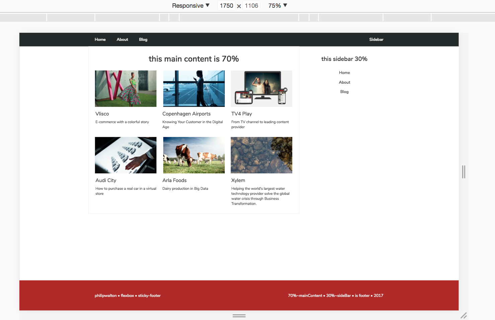
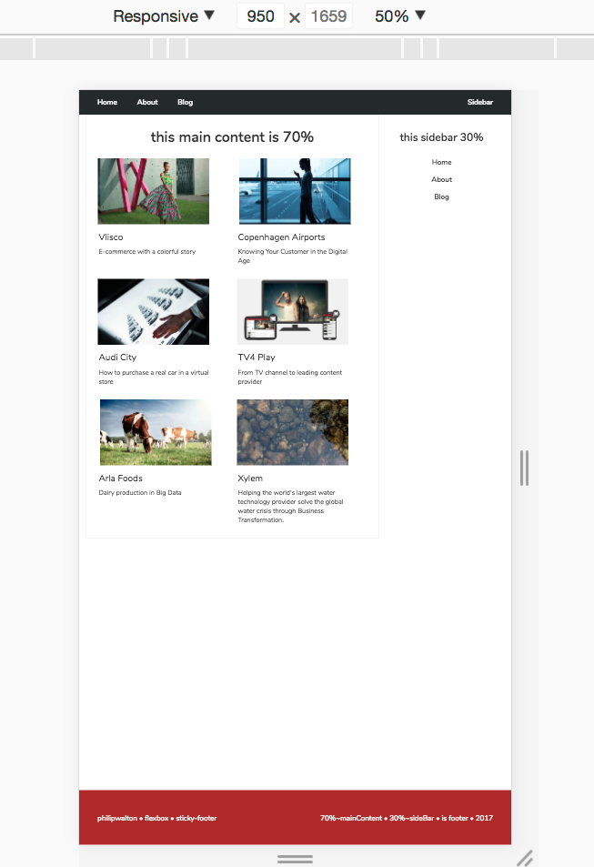
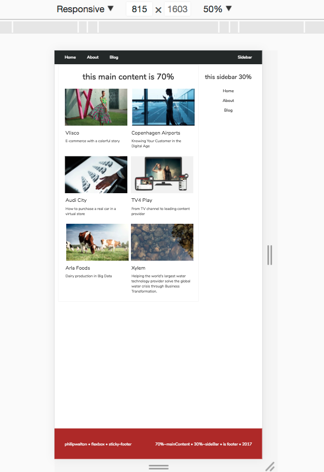
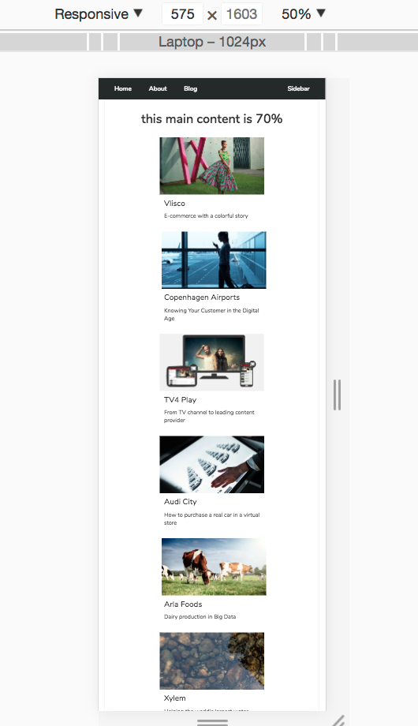
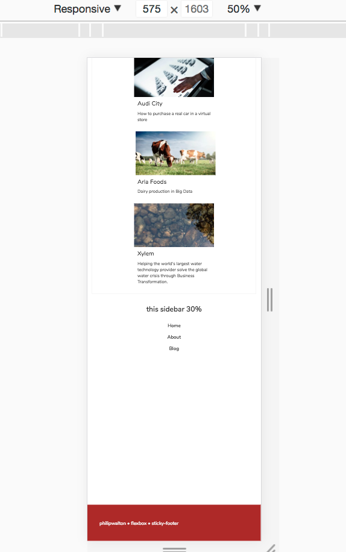
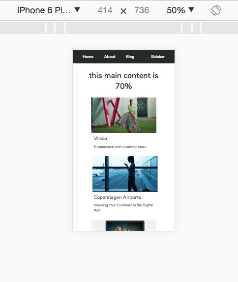
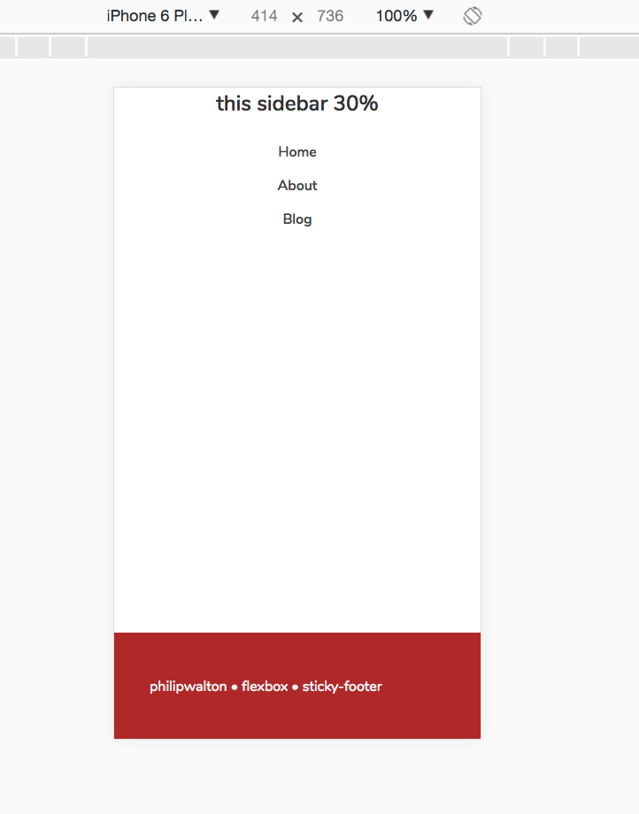
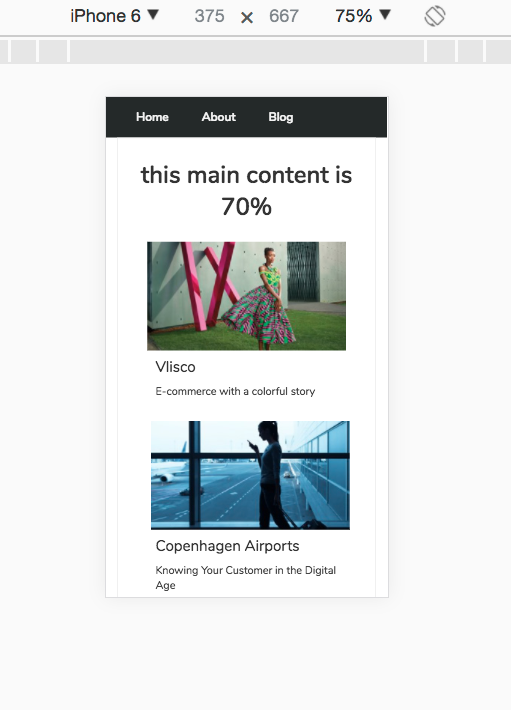
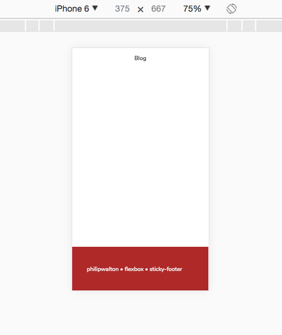

### exercise :clipboard:

- remove all folders/files from start up template
- except for jQuery (cdn) (did not use jQuery)
- added:
   +  test.js file (js folder)
   +  test.css file (css folder)
   +  images folder
- header section => nav with 3 links:
   +  Home(index.html)
   +  About(/about)
   +  Blog(/blog)

#### css 12-row grid 
- 100% divide by 12-rows * row
- 70% => class 84
- 30% => class 36
- layout fully-fluid down to 375 > (iphone6)

#### sticky-footer - flexbox
- newBodyClass => homepg, mainWrapper-prop-val and footerHeight-val

#### group
- isClearfix

#### javascript
- quickest part of entire exercise - 15min
- 2 parts:

   + On page-load (DOMContentLoaded) a click event-listener is added to 
     sidebar nav-menu-item to set display either to block or none.

   + a new built-in date object using getFullYear method to get year,
     it then inserts year to the footer

#### layout

<kbd>1750 :doughnut:</kbd>

<kbd>950 :doughnut:</kbd>         

<kbd>815 :doughnut:</kbd>    

<kbd>575-top :doughnut:</kbd>   

<kbd>575-bottom :doughnut:</kbd>   

<kbd>414-top :doughnut:</kbd>   

<kbd>414-bottom :doughnut:</kbd>   

<kbd>375-top :doughnut:</kbd>   

<kbd>375-bottom :doughnut:</kbd>   

